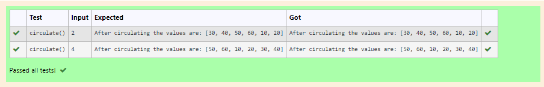

# Circulate-the-values-of-N-variables
## Aim:
To write a python program to circulate the n variables using function concept
## Equipment’s required:
PC
Anaconda - Python 3.7
## Algorithm: 
### Step 1:
Using functions to circulating N values. 
### Step 2: 
Using bulit in function def.
### Step 3: 
Get the value from the user for the number of rotation
### Step 4: 
Using the slicing concept rotate the list
### Step 5: 
Print the final value.
## Program:
```
#Program to circulate N values.
#Developed by: Meenakshi M
#RegisterNumber:21003572
def circulate():
    num1=[10,20,30,40,50,60]
    n=int(input())
    cir=num1[n:]+num1[:n]
    print("After circulating the values are:",cir)
    
```
## Output:

## Result:
Thus the solution for circulating N values has been obtained using python.